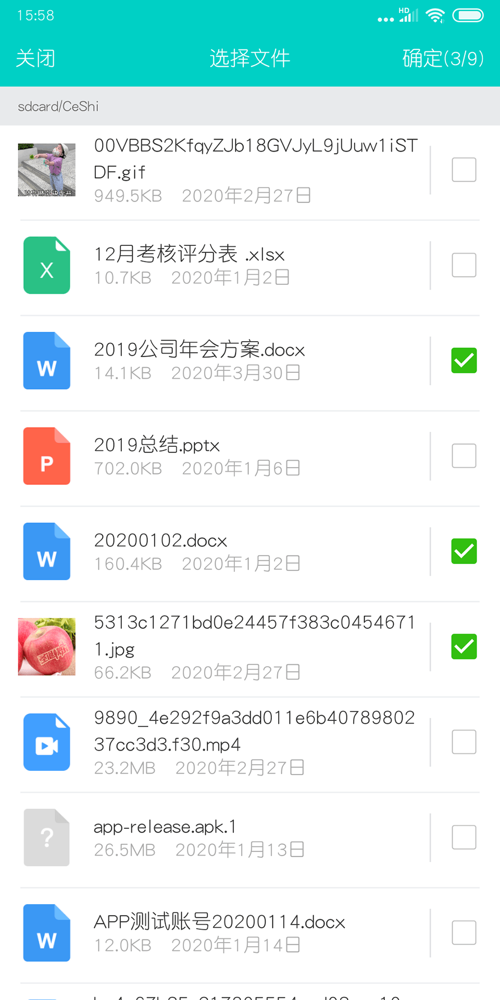

# works_file_picker

选择以及打开文件插件，调用原生sdk.目前仅用于环信

## Screenshots



## usage

# 引入

```yaml
  dependencies:
    flutter:
      sdk: flutter
    works_file_picker:
    #本地路径
      path: /**/flutter_works_file_picker
#或者git地址
#     git:
#       url: git://github.com/cdworks/flutter_works_file_picker.git
```

# 示例
```dart

//选取文件 static Future<List>  pickFile(int barColor ,int titleColor, [int maxNumber = 9,int maxLength = -1]) barColor和titleColor 导航栏背景色以及标题颜色 
//maxNumber  选择文件的最大数量  maxLength 能选择的最大文件大小，单位 MB 默认不限制：-1

List filesInfo = await WorksFilePicker.pickFile(CupertinoTheme.of(context).barBackgroundColor.value,CupertinoTheme.of(context).primaryColor.value,4,12);
if(filesInfo != null && filesInfo.isNotEmpty)
    {
      for(Map info in filesInfo)
      {
        String identifier = info['identifier']; //文件路径
        int type = int.parse(info['type']);   //文件类型 
        num size = info['size']; //文件大小

        if(type == 1) //图片
          {

            num originalWidth = info['originalWidth']; //图片宽度
            num originalHeight = info['originalHeight']; //图片高度

            
          }
        else if(type == 2) //视频
          {
            num w = info['thumbWidth'];  //缩略图宽度
            num  h = info['thumbHeight']; //缩略图高度
            final double duration = info['duration']; //持续时长
            final String thumbUrl = info['thumbUrl'];  //缩略图文件地址
          }
        else
          {
            
          }
      }
    }

 //打开文件 static openFile(int barColor ,int titleColor,String filePath,String fileName)


```